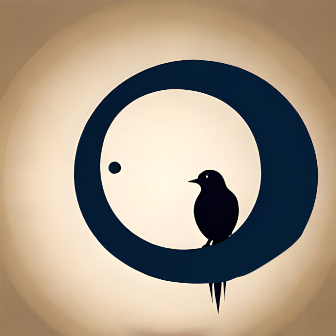
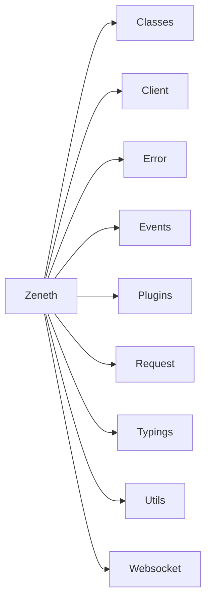

<p align="center">
  <a href="https://aoi.js.org">
    
  </a>
</p>

<h1 align="center">Zeneth</h1>

<div align="center">
  <b>A NodeJs Library that make interaction with discord api </b>
</div>

---

## Installation

```css
npm i zeneth
```
or
```css
yarn add zeneth
```

## Setup

```js
const {
    Client,
    Intents,
    GatewayEventNames,
} = require("zeneth");

const client = new Client({
    intents: Intents.Guilds | Intents.GuildMessages | Intents.MessageContent,
    token: "Token" ,
});


client.on(GatewayEventNames.Ready, () => {
    console.log("Ready!");
});

client.on(GatewayEventNames.MessageCreate, async(message) => {
    if (message.content === "!ping") {
        await client.createMessage(message.channelId, {
            content: "Pong!",
        });
    }
});
```

## Structure



## LICENSE

[Apache 2.0](./LICENSE)

## Our ♥️ Contributors

<a href="https://github.com/Akaruidevelopment/zeneth/graphs/contributors">
  
</a>
